# Content Delivery - Default UI Templates

As of v0.0.1, we provide some default templates to be used to deliver some ads from the ads providers.

## Note:

The UI templates supported here are not finalized yet, so if you have any request for new UI, please kindly contact us if we can help to make and deliver it as the general Ads.

All the UI templates are customizable and can be easily adjusted using a CSS styles. For example, if you want to:

- Adjust the size, padding, margin, height and width of the ads
- Adjust the text's color, font size, and styles
- Probably other things

You can configure the UI custom styles via Content Delivery Admin Tool, and have a preview there before finally deliver the customized UI template.

## Supported Ads Providers

- [RPP BTA](#rpp-bta)
- [Google AdEx](#google-adex)
- [RPP SWAD](#rpp-swad)
- [Yahoo](#yahoo)

## RPP BTA

### BTA Banner 2 Items

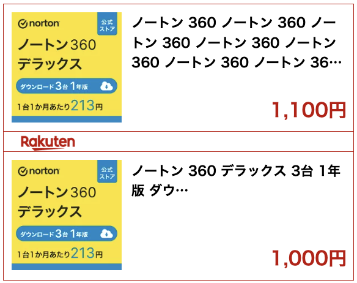

### BTA Banner 1 Item

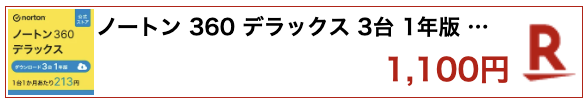

### BTA Card Multi Rows

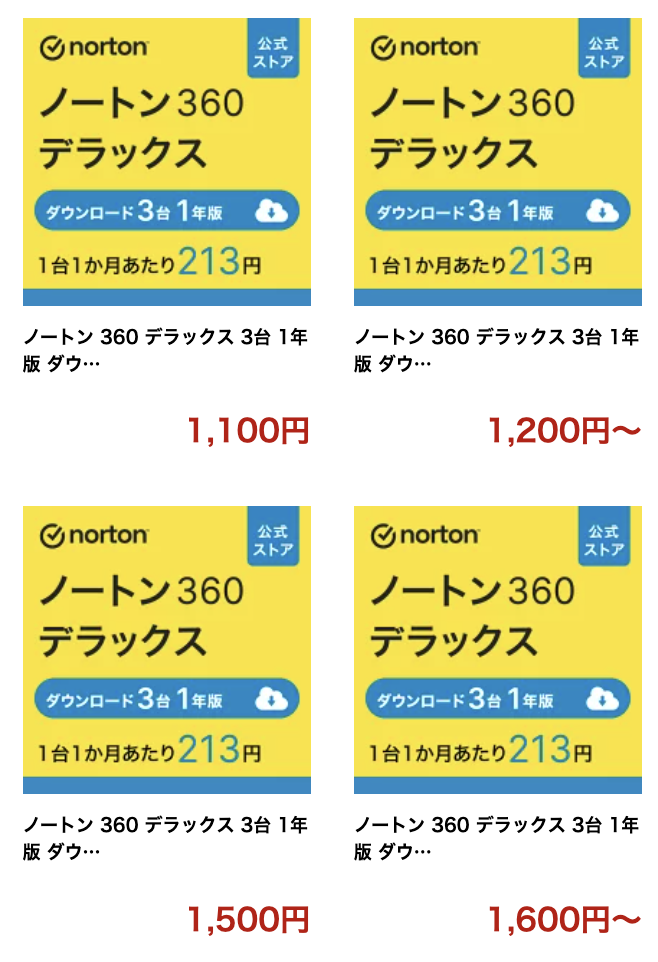

### BTA Card 1 Item

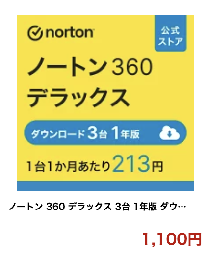

## Google AdEx

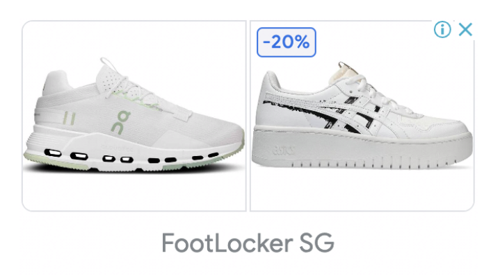

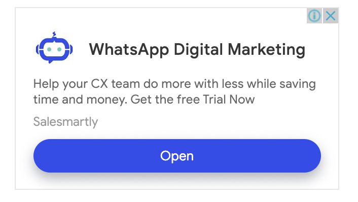

Note: The ads is provided by Google AdEx, and the UI maybe different based on the requested sizes.

## RPP SWAD

### RPP SWAD Horizontal Items

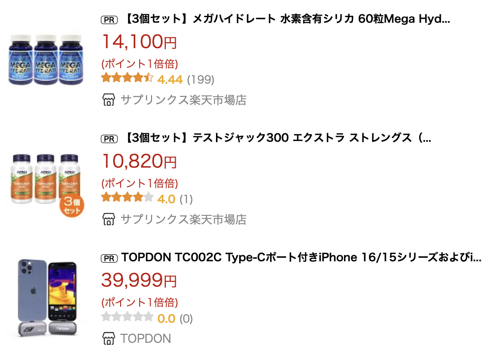

### RPP SWAD Text Items

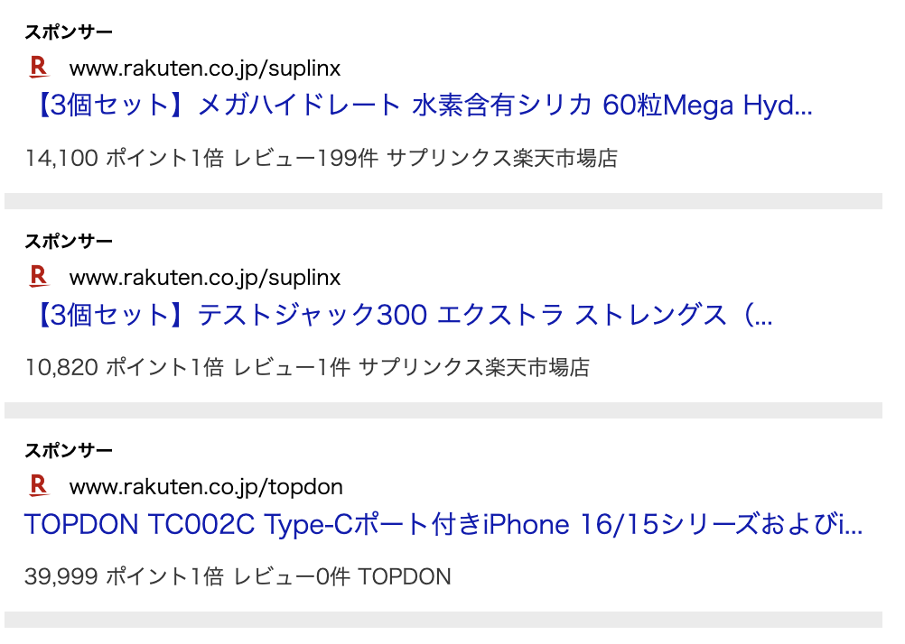

### RPP SWAD Card Items

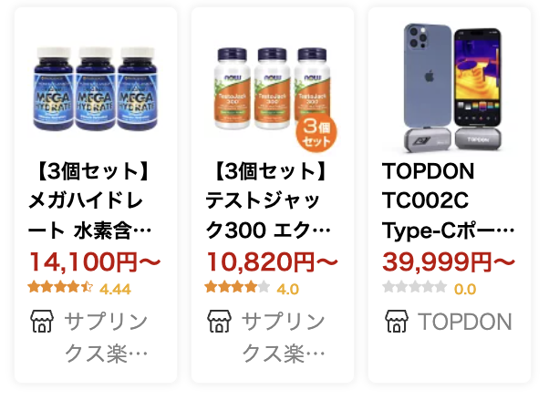

### RPP SWAD Multi Rows

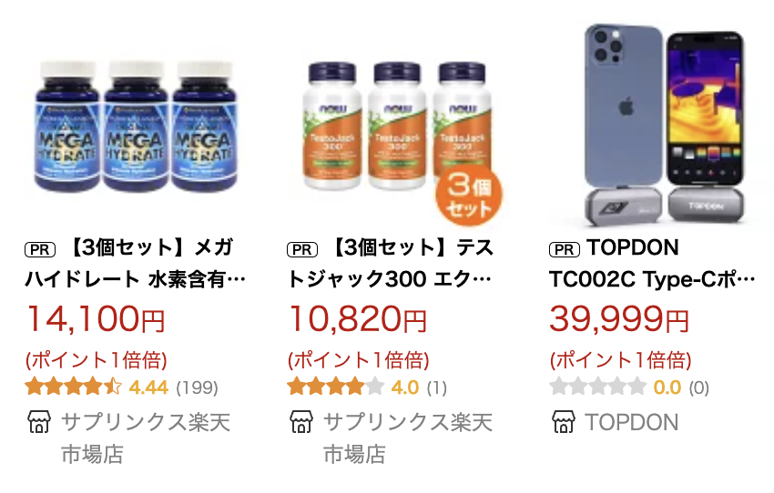

## Yahoo

### Yahoo One Item

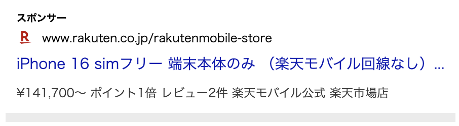

### Yahoo Multi Rows

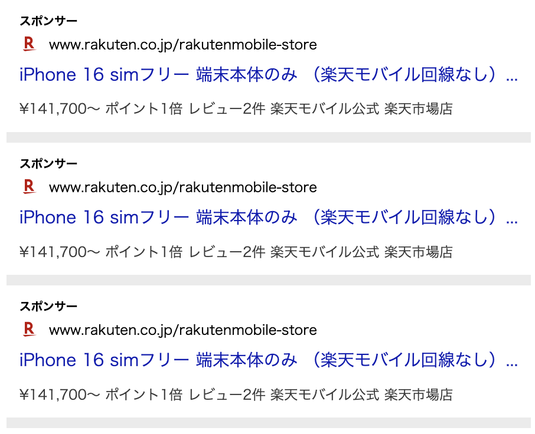
